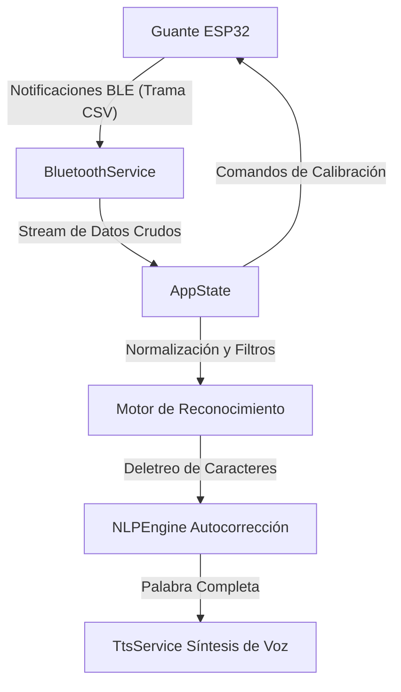

# Manual Técnico y Guía del Proyecto MakiVoice (LSP Translator)

Esta guía documenta detalladamente la arquitectura, las funcionalidades de la aplicación, el protocolo de comunicación de hardware y el firmware del guante traductor. Ha sido actualizada para reflejar exactamente el código de producción del ESP32.

---

## 🏗️ 1. Arquitectura y Estructura del Proyecto

El código de la aplicación de Flutter está organizado siguiendo los principios de **Arquitectura Limpia (Clean Architecture)** separada por módulos (features):

```
lib/
├── core/                         # Núcleo y Utilidades Comunes
│   ├── app_colors.dart           # Definición de colores de marca y glassmorphism
│   ├── constants.dart            # Constantes globales (UUIDs BLE, pines por defecto)
│   └── services/                 # Servicios globales de bajo nivel
│       ├── bluetooth_service.dart # Controlador del stack Bluetooth Low Energy
│       └── nlp_engine.dart       # Algoritmo de autocorrección y distancia de Levenshtein
│
└── features/                     # Módulos de Funcionalidad
    ├── profile/                  # Perfiles de usuario, registro y Auth
    ├── custom_signs/             # Glosario y grabación de señas personalizadas
    ├── learning/                 # Modo aprendizaje, quizzes y niveles
    └── translator/               # Traductor en tiempo real, calibración y voz
```

---

## 📡 2. Flujo de Comunicación e Integración de Hardware

El guante físico, la aplicación móvil y los motores locales de procesamiento de lenguaje y voz están integrados en un lazo cerrado:



### A. Comunicación ESP32 $\rightarrow$ Flutter (Envío de Datos)
El ESP32 del guante se conecta vía **Bluetooth Low Energy (BLE)** a la aplicación de Flutter. 
* **Nombre de Publicidad BLE:** `"GuanteLSP"`
* **UUID del Servicio GATT:** `4fafc201-1fb5-459e-8fcc-c5c9c331914b`
* **UUID de la Característica de Datos:** `a5c7823f-1234-4688-b7f5-ea07361b2c1d` (Notificación habilitada).
* **Frecuencia de Muestreo:** El guante transmite datos en tiempo real cada **50 ms (20 Hz)**.
* **Formato de la Trama (CSV):**
  $$\text{F0,F1,F2,F3,F4,Ax,Ay,Az,Gx,Gy,Gz,D12,D13,D16,D17,D18}$$
  
  * `F0..F4`: Lecturas analógicas filtradas por promedio móvil de flexión (0 a 4095).
  * `Ax,Ay,Az`: Aceleración en $m/s^2$ obtenida por registros crudos I2C: $\text{ax} = (\text{AcX} / 16384.0) \times 9.80665$.
  * `Gx,Gy,Gz`: Velocidad angular en $rad/s$ por I2C: $\text{gx} = (\text{GyX} / 131.0) \times 0.01745$.
  * `D12,D13,D16,D17,D18`: Bits digitales (0 o 1) de los 5 sensores de contacto.

### B. Comunicación Flutter $\rightarrow$ ESP32 (Envío de Comandos)
La aplicación envía comandos escribiendo en la Característica de Datos:
* `SET_LETRA,Letra,F1,F2,F3,F4,F5,Orientacion,Dinamico`: Guarda un gesto personalizado.
* `RESET_LETRA,Letra`: Restablece el gesto a los valores de fábrica.

---

## ⚙️ 3. Algoritmo de Traducción, Calibración y NLP

### A. Calibración y Umbrales (`flexMid`)
Durante la calibración, la aplicación captura:
* `flexMin`: Valores de los sensores flex con la **Mano Abierta** (Paso 0).
* `flexMax`: Valores de los sensores flex con la **Mano Cerrada** (Paso 1).

A partir de estos valores, se calcula el umbral de desempate `flexMid` para cada dedo como el **25%** del recorrido analógico desde la Mano Abierta hacia la Mano Cerrada:
$$\text{flexMid}[i] = \text{openVal}[i] + (\text{closedVal}[i] - \text{openVal}[i]) \times 0.25$$

En tu circuito físico (divisor de tensión inverso):
* `1` = Extendido (Mayor valor analógico, ej. 4000).
* `0` = Doblado (Menor valor analógico, ej. 1200).
* Si la lectura analógica actual es mayor a `flexMid`, el algoritmo asigna un `'1'` (dedo extendido). De lo contrario, asigna `'0'` (dedo doblado).

### B. Reconocimiento y Desempates
Las 26 letras del alfabeto se procesan a través de un árbol de decisión dinámico basado en:
1. **Patrón de Flexión de 5 dígitos** (ej. `'11000'`).
2. **Inclinación de Muñeca:** Evaluando el eje `ax` (acelerómetro) contra el umbral de inclinación para discriminar entre letras opuestas (como **Q** hacia abajo y **L** hacia arriba).
3. **Sensores de Contacto:** Desempatan letras idénticas (como **K** con contacto en la base del medio, y **R** sin contacto).
4. **Gesto de Espacio (`'01011'`):** Añadido de forma exclusiva para espaciar y finalizar palabras sin colisionar con ninguna letra del alfabeto.

### C. Autocorrección Lingüística (NLP con Levenshtein)
Cuando se registra la seña de espacio (`' '` mediante el patrón `'01011'`), la app ejecuta el motor de procesamiento de lenguaje:
* **Autocompletado:** Compara el prefijo de lo que se está deletreando y devuelve hasta **3 sugerencias** en pantalla.
* **Autocorrección (Levenshtein):** Al finalizar la palabra, se compara el texto ingresado con las **747 palabras** del diccionario (647 palabras cotidianas + 100 siglas como **ONPE, SUNAT, RENIEC, UNFV, FIIS, EPIS**).
* Si hay un error, el motor selecciona la palabra con menor distancia de edición y la reemplaza en el texto, pronunciándola de inmediato vía **Text-to-Speech (TTS)**.

---

## 📱 4. Funcionalidades Detalladas de la App

1. **Traductor en Tiempo Real:** 
   * Interfaz con estilo frosted glass (glassmorphism transparente al 60%).
   * Panel dividido: izquierda muestra la seña actual del alfabeto, derecha muestra el carácter reconocido en tamaño gigante.
   * Botones de borrado rápido integrados discretamente dentro del panel de texto.
2. **Configuración de Voz Emergente:**
   * Diálogo modal que concentra los controles de lectura automática, modos de lectura (por letras o por palabras) y el juego imitativo "Repite tú".
3. **Lista de Señas y Glosario:**
   * Muestra las descripciones oficiales del alfabeto peruano y permite re-grabar o personalizar gestos.
4. **Modo Aprendizaje:**
   * Estructura interactiva con 9 niveles de estudio. Cada nivel contiene tarjetas didácticas, pruebas de racha y un examen final evaluado de 5 preguntas para poder desbloquear el siguiente nivel.

---

## 🔌 5. Firmware del ESP32 (Estructura del Código Arduino)

El archivo [esp32_firmware.ino](file:///c:/Users/apaza/Desktop/PROYECTOS%20FLUTTER/LSP/esp32_firmware/esp32_firmware.ino) está estructurado en módulos para garantizar estabilidad:

1. **Definición de Puertos de Entrada:**
   * **Sensores Flex (ADC1):** Pulgar a GPIO 36 (VP), Índice a GPIO 34, Medio a GPIO 35, Anular a GPIO 32, Meñique a GPIO 33.
   * **Contactos (Digital Pull-Up):** Punta índice a GPIO 12, Punta medio a GPIO 13, Medio índice a GPIO 16, Base medio a GPIO 17, Base anular a GPIO 18.
2. **Filtro de Promedio Móvil (`obtenerFlexSuave`):**
   * Configura un buffer circular (`NUM_LECTURAS_PROMEDIO = 5`) para suavizar el ruido analógico del ADC antes de transmitirlo, evitando saltos accidentales de letras en la App.
3. **Escáner y Autodetección I2C del MPU6500:**
   * En `setup()`, el ESP32 realiza un barrido por I2C (pines SDA=21, SCL=22) para autodetectar la dirección I2C del acelerómetro/giroscopio (habitualmente `0x68` o `0x69`).
4. **Lectura de Registros Crudos MPU:**
   * La función `leerMPU()` lee directamente los 14 registros de datos inerciales del MPU6500 por I2C, aplicando las conversiones a unidades estándar ($m/s^2$ y $rad/s$).
5. **BLE GATT Server:**
   * Declara el nombre del dispositivo como `"GuanteLSP"`, levanta el servicio y las características de comunicación. En el loop principal se gestiona la reconexión automática si el celular se desconecta.

---

## 🛠️ 6. Guía para Compartir y Ejecutar el Proyecto

Para transferir y ejecutar el proyecto en la computadora de tu compañero, realiza los siguientes pasos:

1. **Ubicación de la Carpeta Compartida:**
   * Se ha creado la carpeta limpia **`MakiVoice_Compartir`** en el Escritorio. Esta carpeta excluye archivos temporales pesados de compilación (`build`, `.dart_tool`, `.git`) pesando menos de **10 MB**, lo que permite compartirla fácilmente por Google Drive, USB o correo.

2. **Cargar el Código al ESP32 (Firmware):**
   * Tu compañero debe abrir la carpeta **`esp32_firmware`** dentro del proyecto usando el **Arduino IDE**.
   * Conectar el ESP32 por USB, seleccionar la placa (ej. *ESP32 Dev Module*) y subir el programa.

3. **Abrir el Proyecto Flutter:**
   * Abrir **Android Studio** o **VS Code** y seleccionar la carpeta `MakiVoice_Compartir`.
   * Abrir una terminal en la raíz del proyecto y descargar los paquetes limpios escribiendo:
     ```bash
     flutter pub get
     ```
   * Ejecutar la aplicación en modo desarrollo conectando un dispositivo Android físico o ejecutando:
     ```bash
     flutter run
     ```
